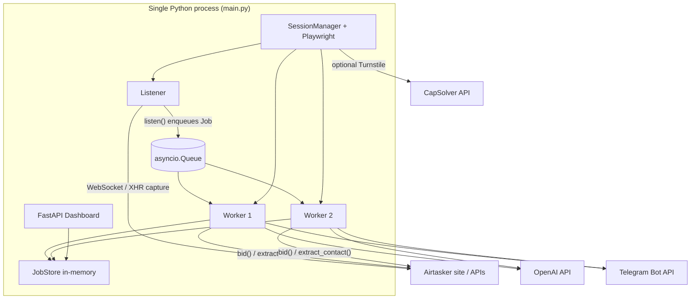

# AI Lead Automation — Technical Guide

**Audience:** Operators and engineers who want to understand how this repository works and what is required for production readiness.  
**Scope:** Describes the **current** implementation as of repo review (May 2026). For a **planned** split architecture, see [`PRODUCTION_PLAN.md`](../PRODUCTION_PLAN.md) at the repo root.

---

## 1. What this project does

This is a **server-side automation agent** that:

1. Opens a **persisted Playwright browser session** for **Airtasker** (Australian task marketplace).
2. **Monitors** the open tasks feed in real time by intercepting **WebSocket frames** and **HTTP responses** (`/api/v2/tasks`, GraphQL-shaped payloads).
3. For each new task, runs a pipeline: **deduplicate → evaluate (rules + LLM) → optionally submit a bid → notify via Telegram**.
4. Exposes a **FastAPI dashboard** (HTML + REST + Server-Sent Events) for logs, stats, leads, and triggering **manual login**.

**Legal / policy:** Automated interaction may violate third-party terms of service. The README disclaimer applies; production use implies your own compliance review.

---

## 2. High-level architecture

**Important:** The agent loop and dashboard run **together** inside `asyncio.gather()` in [`main.py`](../main.py). They share one in-process [`JobStore`](../agent/store.py).

---

## 3. Entry point and runtime modes

[`main.py`](../main.py):

| Mode | Behavior |
|------|------------|
| Default | Starts **Listener** (Airtasker pipeline) + **Uvicorn** (dashboard on `settings.dashboard_port`, default `8000`). |
| `--dry-run` | Sets `DRY_RUN=true` in the environment so **no real bids** are submitted; evaluated jobs are marked as if bid sent for UI purposes. |
| `--dashboard-only` | Only the FastAPI server — useful for UI/testing without the browser agent. |

Logging:

- Console (loguru, level from `LOG_LEVEL`).
- Rotating file under `logs/agent_YYYY-MM-DD.log`.
- INFO+ lines are also pushed into the in-memory store for the dashboard (see `_sync_store_sink` in `main.py`).

---

## 4. End-to-end job pipeline

### 4.1 Listener ([`agent/listener.py`](../agent/listener.py))

1. **Startup:** Sends Telegram “agent started” via [`notifier`](../agent/notifier.py).
2. **Session gate:** Loops until [`store.get_session_status()`](../agent/store.py) is `VALID` and [`session.start()`](../agent/session.py) succeeds (loads `.playwright_storage/airtasker_session.json` if present, validates by hitting the dashboard URL).
3. **Concurrency:**
   - **`_listen_loop`:** [`AirtaskerPlatform.listen(page, queue)`](../platforms/airtasker.py) — long-running; on crash, notifies Telegram, sleeps, refreshes page from `session.get_page()`.
   - **Two `_worker_loop` instances:** `queue.get()` → `_process(job)`.

### 4.2 Per-job processing (`_process`)

1. **Dedup:** `store.is_seen(job.id)` — if already in store, return.  
2. **`store.add_job`** + log line.  
3. **Daily cap:** Reads `max_daily_bids` from profile (default **20** in sample profile). Compares to `store.get_stats()["bids_sent"]` (see §6.1 for how “bids” are counted).  
4. **Evaluate:** [`evaluate(job, profile)`](../agent/evaluator.py) — mutates job (distance, skip reason, LLM bid text/price).  
5. If not `job.ai_approved`, stop.  
6. If `settings.dry_run`, log and mark `BID_SENT` without calling Playwright.  
7. Else **[`Bidder.submit(job)`](../agent/bidder.py):** new tab → `platform.bid` → on success, `extract_contact`, possibly mark `WON` and Telegram win message.

---

## 5. Module reference

### 5.1 Configuration ([`config/settings.py`](../config/settings.py))

Pydantic `BaseSettings`: loads **`.env`** and environment variables.

| Area | Variables (examples) |
|------|----------------------|
| LLM | `OPENAI_API_KEY`, `OPENAI_MODEL`, optional `OPENAI_BASE_URL` |
| Airtasker credentials | `AIRTASKER_EMAIL`, `AIRTASKER_PASSWORD` (used for legacy/config symmetry; **automated login in session is effectively disabled** — see §5.4) |
| Telegram | `TELEGRAM_BOT_TOKEN`, `TELEGRAM_CHAT_ID` |
| Turnstile | `CAPSOLVER_API_KEY` (optional but recommended for headless) |
| Proxy | `PROXY_HOST`, `PROXY_PORT`, `PROXY_USERNAME`, `PROXY_PASSWORD`, `PROXY_PROTOCOL` |
| Ops | `DASHBOARD_PORT`, `REDIS_URL`, `DRY_RUN`, `LOG_LEVEL` |
| Profile | `PROFILE_PATH` or `PROFILE_JSON` |

**Note:** `DASHBOARD_SECRET` is defined with description “Basic auth secret” but **is not wired into the FastAPI app** — the dashboard has **no authentication** today (§9.1).

**Profile JSON** ([`config/profiles/default.json`](../config/profiles/default.json)) includes: `name`, `home_suburb`, `home_lat`/`home_lng`, `radius_km`, `skills`, `excluded_skills`, `min_hourly_rate`, `default_bid_price`, `bid_template`, `max_daily_bids`, `max_concurrent_bids` (the last is **not enforced** in the code paths reviewed — only daily cap is).

### 5.2 Data models ([`agent/models.py`](../agent/models.py))

- **`Job`:** Normalised task: id, title, description, suburb, state, budget, url, geo, status, AI fields, customer contact fields.
- **`JobStatus`:** `new` → `evaluating` → `skipped` | `bidding` → `bid_sent` | `won` | `failed`.
- **`SkipReason`:** Used for filters and AI outcomes.

### 5.3 Store ([`agent/store.py`](../agent/store.py))

- **`JobStore`** is **in-process only** (asyncio lock, dict of jobs, deque of last **500** log lines).
- **Not** persisted across restarts; **not** shared across multiple machines/processes.

**Redis:** `REDIS_URL` exists in settings and Redis is started in [`docker-compose.yml`](../docker-compose.yml), but **no application code imports or uses Redis** — this is currently **unused infrastructure** (§9.2).

### 5.4 Session ([`agent/session.py`](../agent/session.py))

- Stores Playwright storage at **`.playwright_storage/airtasker_session.json`**.
- **`start()`:** Launches Chromium via [`make_browser_context`](../stealth/browser.py), loads storage state if file exists, checks login by navigating to dashboard and looking for logged-in selectors; updates `SessionStatus` in store.
- **`manual_login()`:** Opens **visible** browser (prefers **Google Chrome** channel for Turnstile compatibility), waits up to ~5 minutes for login indicators, saves storage state. Invoked from dashboard `POST /api/session/login` as a **background task** (non-blocking).
- **`_login()`:** Empty — **password-based auto login is not implemented** in the current code.

### 5.5 Evaluator ([`agent/evaluator.py`](../agent/evaluator.py))

1. If job lacks lat/lng, **geocodes** suburb via **Nominatim** (public geocoder — rate limits and latency apply in production).
2. **Haversine distance** vs profile; skip if beyond `radius_km`.
3. **Keyword exclusion:** `excluded_skills` substrings in title+description.
4. **OpenAI** JSON response: approve/skip, `bid_price`, `bid_message`, etc. Model and base URL come from settings.

### 5.6 Bidder ([`agent/bidder.py`](../agent/bidder.py))

- One **new browser tab** per bid (isolated navigation).
- Delegates DOM work to **`AirtaskerPlatform.bid`** and **`extract_contact`**.

### 5.7 Notifier ([`agent/notifier.py`](../agent/notifier.py))

- **python-telegram-bot** `Bot` with **MarkdownV2** escaping for messages: win, bid placed, errors, startup.

### 5.8 Airtasker platform ([`platforms/airtasker.py`](../platforms/airtasker.py))

- **`listen`:** Registers handlers **before** `goto` on open tasks URL; periodically scrolls and reloads ~every 5 minutes to refresh feed.
- **Parsing:** Recursively finds task-shaped dicts; maintains local **`_seen_ids`** set (per process) in addition to store dedup.
- **`bid`:** Humanised click/type via [`stealth/behavior.py`](../stealth/behavior.py), Turnstile hook, success heuristics (selectors + URL).
- **`extract_contact`:** Regex on HTML for AU phone and email; optional name selector.

### 5.9 Stealth stack

| File | Role |
|------|------|
| [`stealth/browser.py`](../stealth/browser.py) | Launches Chromium with proxy, optional `playwright-stealth`, large init script OR **minimal** webdriver-only script for CAPTCHA flows; `trust_browser_defaults` + `channel="chrome"` for real Chrome. |
| [`stealth/captcha.py`](../stealth/captcha.py) | Detects Turnstile; **CapSolver** inject path; fallback wait/click. |
| [`stealth/capsolver_client.py`](../stealth/capsolver_client.py) | `AntiTurnstileTaskProxyLess` createTask / getTaskResult polling. |
| [`stealth/behavior.py`](../stealth/behavior.py) | Delays, humanised typing and clicking, scrolling. |

### 5.10 Dashboard ([`dashboard/app.py`](../dashboard/app.py))

| Endpoint | Purpose |
|----------|---------|
| `GET /` | Serves [`dashboard/static/index.html`](../dashboard/static/index.html) |
| `GET /api/stats` | Aggregates from store |
| `GET /api/leads` | All jobs, newest first |
| `GET /api/logs` | Last 200 log lines |
| `GET /api/stream` | **SSE** — polls store every 1s, pushes new lines |
| `GET /api/session/status` | Session enum value |
| `POST /api/session/login` | Fires `session.manual_login()` in background |

**StaticFiles** is imported but the primary UI is inline-served `index.html` at `/`.

---

## 6. Operational details

### 6.1 Stats calculation ([`JobStore.get_stats`](../agent/store.py))

- **`bids_sent`:** Count of jobs whose status is **`bidding`**, **`bid_sent`**, or **`won`** — not only completed bids.
- **`win_rate`:** `won / bids_sent` (if bids_sent > 0).
- **`est_earnings`:** Sum of `bid_price` for `won` jobs (approximation, not platform-confirmed payout).

### 6.2 Docker ([`Dockerfile`](../Dockerfile), [`docker-compose.yml`](../docker-compose.yml), [`supervisord.conf`](../supervisord.conf))

- Image: **Playwright Python** base (Chromium included).
- **Supervisord** runs: **Xvfb** (`:99`), **fluxbox**, **x11vnc**, **noVNC** (port **6080**), and **`python main.py`** with `DISPLAY=:99` (headful browser inside container).
- Compose mounts: `./logs`, **`./playwright_storage` → `/app/.playwright_storage`**, `./config/profiles`.
- **`shm_size: 2gb`** — important for Chromium stability.

### 6.3 PM2 ([`ecosystem.config.js`](../ecosystem.config.js))

Runs `main.py` with `python3` on the host — you must install Playwright browsers and dependencies yourself; no XvNC stack unless you add it.

### 6.4 Manual login on host ([`scripts/manual_login.py`](../scripts/manual_login.py))

Useful when Docker or the agent cannot complete Turnstile: saves session JSON to the same path the agent reads, with matching proxy/stealth options.

---

## 7. Tests

- [`tests/test_evaluator.py`](../tests/test_evaluator.py), [`tests/test_notifier.py`](../tests/test_notifier.py) — unit-style tests (mocked OpenAI / Telegram).
- [`tests/mock_ws_server.py`](../tests/mock_ws_server.py) — fake WebSocket server for listener-related testing.

Run: `pytest tests/ -v` (see README).

---

## 8. How this relates to `PRODUCTION_PLAN.md`

[`PRODUCTION_PLAN.md`](../PRODUCTION_PLAN.md) describes a **target** architecture: split Next.js frontend, `/api/v1` REST, WebSockets, JWT auth, optional Postgres, Redis-backed state. **That is not implemented in this repo yet.** The current app is a **monolith** matching the “Current Architecture” section of that document.

---

## 9. Production readiness — gaps and recommendations

### 9.1 Security

- **No authentication** on dashboard or APIs — anyone who can reach port 8000 can view leads and **trigger manual login**.
- **`DASHBOARD_SECRET` is unused** — either implement Basic Auth / JWT or remove the misleading setting.
- **Secrets in `.env`** — ensure file permissions, secret manager in cloud, never commit.
- **Rate limiting / abuse** — not present on `POST /api/session/login`.

### 9.2 State and scaling

- **In-memory store** — restarting the process loses history; **horizontal scaling** (multiple agents) would duplicate bids unless you add shared deduplication.
- **Redis** is in Compose but **unused** — either implement dedup/locks/stats in Redis or remove the service to reduce confusion.

### 9.3 Reliability

- **Listener** restarts on exception but **session expiry** after start is only partially handled (`get_page` sets `EXPIRED` but does not auto re-login).
- **Nominatim** for production should be replaced or cached (blocked IP, timeouts, ToS).
- **LLM failures** mark skip — consider retries and circuit breakers.
- **Platform DOM changes** — bid/selectors will break silently; needs monitoring and tests against staging.

### 9.4 Observability

- File logs exist; no structured logging aggregation, metrics, or tracing hooks in code.
- Health checks: add **`/health`** for orchestrators (Compose/K8s).

### 9.5 Configuration hygiene

- README references **`.env.example`** — confirm it exists in your deployment repo (it may be gitignored here).

### 9.6 Product / compliance

- Re-read Airtasker terms; consider **dry-run** in staging, bid caps, and human review gates before full automation.

---

## 10. Quick file map

| Path | Responsibility |
|------|----------------|
| `main.py` | Process entry, logging, concurrent agent + dashboard |
| `agent/listener.py` | Orchestration, queue, workers |
| `agent/evaluator.py` | Geo + LLM evaluation |
| `agent/bidder.py` | Tab lifecycle + bid + contact |
| `agent/session.py` | Browser + session file + manual login |
| `agent/store.py` | In-memory jobs, logs, session status |
| `agent/notifier.py` | Telegram |
| `agent/models.py` | Job / enums |
| `platforms/airtasker.py` | Listen, parse, bid, scrape |
| `platforms/base.py` | Adapter interface |
| `stealth/*` | Browser factory, CAPTCHA, humanisation |
| `dashboard/app.py` | FastAPI + SSE |
| `config/settings.py` | Environment config |
| `config/profiles/*.json` | Business rules + trader profile |
| `Dockerfile` / `docker-compose.yml` / `supervisord.conf` | Container runtime |
| `scripts/manual_login.py` | Host-side session capture |

---

*This guide was generated from a full repository review. When you change behavior (e.g. add Redis or auth), update this document in the same PR.*
